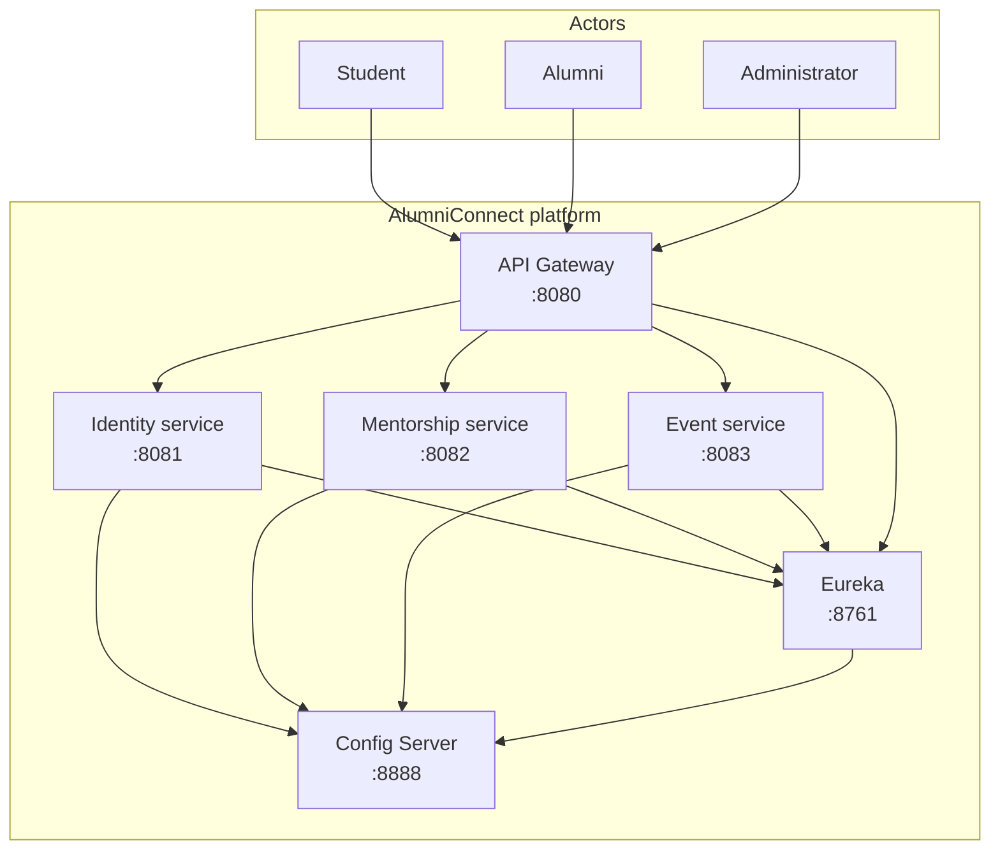

# AlumniConnect — system context

This diagram is the ISO-style **system context** view: actors, the platform boundary, and external systems.

Traffic enters through the **gateway**; services **register** with Eureka and load **centralised configuration** from the Config Server. See `README.md` for run order and ports.
